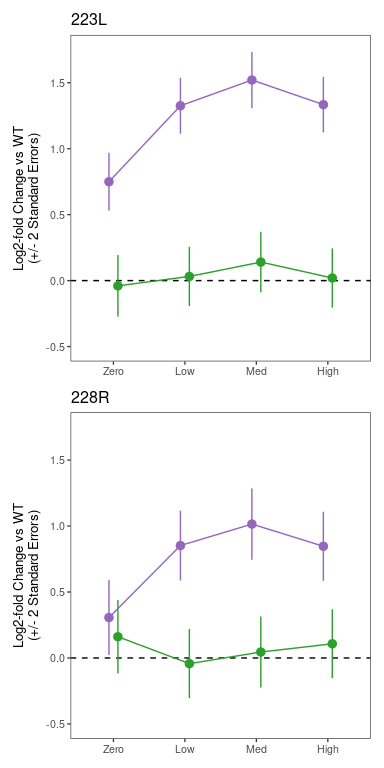
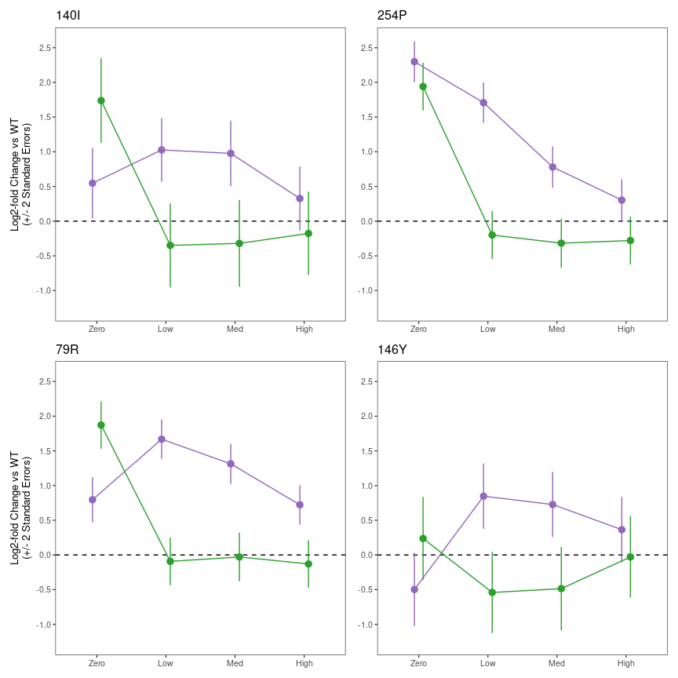
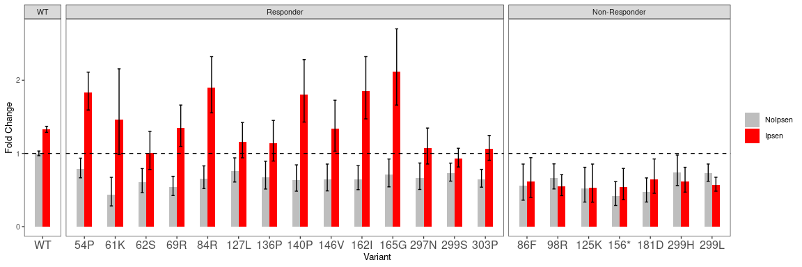
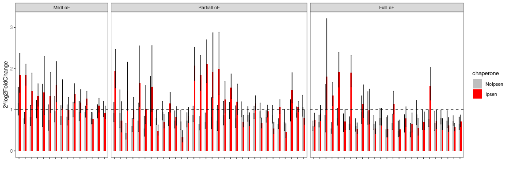
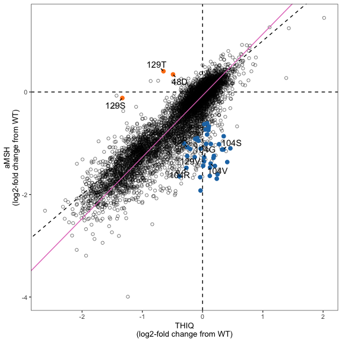
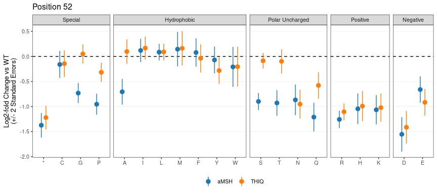

MC4R Figure Generation
================
Nathan Abell and Nathan Lubock
June 07, 2024

# Introduction

This document will recreate all of the figures for the manuscript.
Extended figures are included in the same directory as their
corresponding main figures for clarity.

But first, a little data munging to get everything annotated an
consistent.

# Figure 1

## Main Figures

## Extended Figures

### Library Dosing

    ## Running /Library/Frameworks/R.framework/Resources/bin/R CMD SHLIB foo.c
    ## using C compiler: ‘Apple clang version 15.0.0 (clang-1500.3.9.4)’
    ## using SDK: ‘’
    ## clang -arch arm64 -I"/Library/Frameworks/R.framework/Resources/include" -DNDEBUG   -I"/Library/Frameworks/R.framework/Versions/4.3-arm64/Resources/library/Rcpp/include/"  -I"/Library/Frameworks/R.framework/Versions/4.3-arm64/Resources/library/RcppEigen/include/"  -I"/Library/Frameworks/R.framework/Versions/4.3-arm64/Resources/library/RcppEigen/include/unsupported"  -I"/Library/Frameworks/R.framework/Versions/4.3-arm64/Resources/library/BH/include" -I"/Library/Frameworks/R.framework/Versions/4.3-arm64/Resources/library/StanHeaders/include/src/"  -I"/Library/Frameworks/R.framework/Versions/4.3-arm64/Resources/library/StanHeaders/include/"  -I"/Library/Frameworks/R.framework/Versions/4.3-arm64/Resources/library/RcppParallel/include/"  -I"/Library/Frameworks/R.framework/Versions/4.3-arm64/Resources/library/rstan/include" -DEIGEN_NO_DEBUG  -DBOOST_DISABLE_ASSERTS  -DBOOST_PENDING_INTEGER_LOG2_HPP  -DSTAN_THREADS  -DUSE_STANC3 -DSTRICT_R_HEADERS  -DBOOST_PHOENIX_NO_VARIADIC_EXPRESSION  -D_HAS_AUTO_PTR_ETC=0  -include '/Library/Frameworks/R.framework/Versions/4.3-arm64/Resources/library/StanHeaders/include/stan/math/prim/fun/Eigen.hpp'  -D_REENTRANT -DRCPP_PARALLEL_USE_TBB=1   -I/opt/R/arm64/include    -fPIC  -falign-functions=64 -Wall -g -O2  -c foo.c -o foo.o
    ## In file included from <built-in>:1:
    ## In file included from /Library/Frameworks/R.framework/Versions/4.3-arm64/Resources/library/StanHeaders/include/stan/math/prim/fun/Eigen.hpp:22:
    ## In file included from /Library/Frameworks/R.framework/Versions/4.3-arm64/Resources/library/RcppEigen/include/Eigen/Dense:1:
    ## In file included from /Library/Frameworks/R.framework/Versions/4.3-arm64/Resources/library/RcppEigen/include/Eigen/Core:88:
    ## /Library/Frameworks/R.framework/Versions/4.3-arm64/Resources/library/RcppEigen/include/Eigen/src/Core/util/Macros.h:628:1: error: unknown type name 'namespace'
    ## namespace Eigen {
    ## ^
    ## /Library/Frameworks/R.framework/Versions/4.3-arm64/Resources/library/RcppEigen/include/Eigen/src/Core/util/Macros.h:628:16: error: expected ';' after top level declarator
    ## namespace Eigen {
    ##                ^
    ##                ;
    ## In file included from <built-in>:1:
    ## In file included from /Library/Frameworks/R.framework/Versions/4.3-arm64/Resources/library/StanHeaders/include/stan/math/prim/fun/Eigen.hpp:22:
    ## In file included from /Library/Frameworks/R.framework/Versions/4.3-arm64/Resources/library/RcppEigen/include/Eigen/Dense:1:
    ## /Library/Frameworks/R.framework/Versions/4.3-arm64/Resources/library/RcppEigen/include/Eigen/Core:96:10: fatal error: 'complex' file not found
    ## #include <complex>
    ##          ^~~~~~~~~
    ## 3 errors generated.
    ## make: *** [foo.o] Error 1

    ##  Family: gaussian 
    ##   Links: mu = identity; sigma = identity 
    ## Formula: fold ~ 1 + (emax - 1)/(1 + 10^(slope * (ec50 - log10(conc)))) 
    ##          ec50 ~ -1 + drug
    ##          emax ~ 1
    ##          slope ~ 1
    ##    Data: library_luci_norm %>% filter(reporter == "Gs") (Number of observations: 72) 
    ##   Draws: 4 chains, each with iter = 2000; warmup = 1000; thin = 1;
    ##          total post-warmup draws = 4000
    ## 
    ## Population-Level Effects: 
    ##                 Estimate Est.Error l-95% CI u-95% CI Rhat Bulk_ESS Tail_ESS
    ## ec50_drugaMSH      -9.50      0.13    -9.76    -9.24 1.00     4499     3038
    ## ec50_drugTHIQ      -9.40      0.15    -9.68    -9.12 1.00     4080     3013
    ## emax_Intercept     60.93      0.94    59.07    62.75 1.00     3737     2764
    ## slope_Intercept     0.72      0.09     0.57     0.93 1.00     4461     3244
    ## 
    ## Family Specific Parameters: 
    ##       Estimate Est.Error l-95% CI u-95% CI Rhat Bulk_ESS Tail_ESS
    ## sigma     8.88      0.77     7.53    10.53 1.00     3830     2793
    ## 
    ## Draws were sampled using sampling(NUTS). For each parameter, Bulk_ESS
    ## and Tail_ESS are effective sample size measures, and Rhat is the potential
    ## scale reduction factor on split chains (at convergence, Rhat = 1).

Same thing for Gq

    ## Running /Library/Frameworks/R.framework/Resources/bin/R CMD SHLIB foo.c
    ## using C compiler: ‘Apple clang version 15.0.0 (clang-1500.3.9.4)’
    ## using SDK: ‘’
    ## clang -arch arm64 -I"/Library/Frameworks/R.framework/Resources/include" -DNDEBUG   -I"/Library/Frameworks/R.framework/Versions/4.3-arm64/Resources/library/Rcpp/include/"  -I"/Library/Frameworks/R.framework/Versions/4.3-arm64/Resources/library/RcppEigen/include/"  -I"/Library/Frameworks/R.framework/Versions/4.3-arm64/Resources/library/RcppEigen/include/unsupported"  -I"/Library/Frameworks/R.framework/Versions/4.3-arm64/Resources/library/BH/include" -I"/Library/Frameworks/R.framework/Versions/4.3-arm64/Resources/library/StanHeaders/include/src/"  -I"/Library/Frameworks/R.framework/Versions/4.3-arm64/Resources/library/StanHeaders/include/"  -I"/Library/Frameworks/R.framework/Versions/4.3-arm64/Resources/library/RcppParallel/include/"  -I"/Library/Frameworks/R.framework/Versions/4.3-arm64/Resources/library/rstan/include" -DEIGEN_NO_DEBUG  -DBOOST_DISABLE_ASSERTS  -DBOOST_PENDING_INTEGER_LOG2_HPP  -DSTAN_THREADS  -DUSE_STANC3 -DSTRICT_R_HEADERS  -DBOOST_PHOENIX_NO_VARIADIC_EXPRESSION  -D_HAS_AUTO_PTR_ETC=0  -include '/Library/Frameworks/R.framework/Versions/4.3-arm64/Resources/library/StanHeaders/include/stan/math/prim/fun/Eigen.hpp'  -D_REENTRANT -DRCPP_PARALLEL_USE_TBB=1   -I/opt/R/arm64/include    -fPIC  -falign-functions=64 -Wall -g -O2  -c foo.c -o foo.o
    ## In file included from <built-in>:1:
    ## In file included from /Library/Frameworks/R.framework/Versions/4.3-arm64/Resources/library/StanHeaders/include/stan/math/prim/fun/Eigen.hpp:22:
    ## In file included from /Library/Frameworks/R.framework/Versions/4.3-arm64/Resources/library/RcppEigen/include/Eigen/Dense:1:
    ## In file included from /Library/Frameworks/R.framework/Versions/4.3-arm64/Resources/library/RcppEigen/include/Eigen/Core:88:
    ## /Library/Frameworks/R.framework/Versions/4.3-arm64/Resources/library/RcppEigen/include/Eigen/src/Core/util/Macros.h:628:1: error: unknown type name 'namespace'
    ## namespace Eigen {
    ## ^
    ## /Library/Frameworks/R.framework/Versions/4.3-arm64/Resources/library/RcppEigen/include/Eigen/src/Core/util/Macros.h:628:16: error: expected ';' after top level declarator
    ## namespace Eigen {
    ##                ^
    ##                ;
    ## In file included from <built-in>:1:
    ## In file included from /Library/Frameworks/R.framework/Versions/4.3-arm64/Resources/library/StanHeaders/include/stan/math/prim/fun/Eigen.hpp:22:
    ## In file included from /Library/Frameworks/R.framework/Versions/4.3-arm64/Resources/library/RcppEigen/include/Eigen/Dense:1:
    ## /Library/Frameworks/R.framework/Versions/4.3-arm64/Resources/library/RcppEigen/include/Eigen/Core:96:10: fatal error: 'complex' file not found
    ## #include <complex>
    ##          ^~~~~~~~~
    ## 3 errors generated.
    ## make: *** [foo.o] Error 1

    ##  Family: gaussian 
    ##   Links: mu = identity; sigma = identity 
    ## Formula: fold ~ 1 + (emax - 1)/(1 + 10^(slope * (ec50 - log10(conc)))) 
    ##          ec50 ~ -1 + drug
    ##          emax ~ 1
    ##          slope ~ 1
    ##    Data: library_luci_norm %>% filter(reporter == "Gq") (Number of observations: 76) 
    ##   Draws: 4 chains, each with iter = 2000; warmup = 1000; thin = 1;
    ##          total post-warmup draws = 4000
    ## 
    ## Population-Level Effects: 
    ##                 Estimate Est.Error l-95% CI u-95% CI Rhat Bulk_ESS Tail_ESS
    ## ec50_drugaMSH      -8.23      0.15    -8.50    -7.92 1.00     1528     2216
    ## ec50_drugTHIQ      -9.05      0.16    -9.36    -8.69 1.00     1384     1971
    ## emax_Intercept      2.89      0.11     2.70     3.12 1.00     1203     1823
    ## slope_Intercept     0.49      0.07     0.37     0.63 1.00     1946     2289
    ## 
    ## Family Specific Parameters: 
    ##       Estimate Est.Error l-95% CI u-95% CI Rhat Bulk_ESS Tail_ESS
    ## sigma     0.27      0.02     0.23     0.32 1.00     2667     2159
    ## 
    ## Draws were sampled using sampling(NUTS). For each parameter, Bulk_ESS
    ## and Tail_ESS are effective sample size measures, and Rhat is the potential
    ## scale reduction factor on split chains (at convergence, Rhat = 1).

Now let’s plot the predictions together!

<!-- -->

### Effect of Barcodes

<!-- -->

### Correlation to Computational Predictions

<!-- -->

Write out aMSH data for both pathways with various predictors

# Figure 2

## Main Figures

### aMSH Heatmap Split

Let’s split the protein up in two and use patchwork to smash it together

<!-- -->

### aMSH Heatmap Long

<!-- -->

### Example Heatmaps

<!-- -->

### ClinVar

<!-- -->

### gnomAD

<!-- -->

### Literature Mutants

<!-- -->

### Delta EC50s from Literature

<!-- -->

### Variant Classification

<!-- -->

## Patchwork

<!-- -->

## Extended Figures

### aMSH Heatmap (Log2FC)

<!-- -->

### Show of Force (Z’s)

<!-- -->

### Show of Force (Log2FC)

<!-- -->

# Figure 3

## Main Figures

### PCA for Bias

<!-- -->

### Specific Mutants

<!-- -->

<!-- -->

### Patchwork

<!-- -->

## Extended Figures

### Bias PCA with Stops

<!-- -->

### Bias PCA with Loadings

<!-- -->

### Write TSV out for Structure

We’ll also write out the PC’s for projecting onto the structure

### More Biased Residue Zooms

<!-- -->

### 79 all

<!-- -->

### 79 zoom

<!-- -->

# Figure 4

## Main Figures

### Scaled (0-1) Rescue Effects Across All Variants

<!-- -->

### Custom Variant Set

<!-- -->

### Wang 2014 Variants

<!-- -->

<!-- -->

### Huang 2017 Variants

<!-- -->

<!-- -->

## Extended Figures

### Rescue/Defect Effects Across All Variants

<!-- -->

### Rescue/Defect Z-Statistics Across All Variants

<!-- -->

# Figure 5

## Main Figures

### THIQ vs aMSH meta-regression

    ## process    real 
    ##    7.9s   1.69m

<!-- -->

As a table, here’s the 5% FDR’s

| pos | aa  | est_aMSH | est_THIQ | residual_z | residual_fdr |
|----:|:----|---------:|---------:|-----------:|-------------:|
|  46 | R   |    -0.67 |     0.10 |      -4.96 |         3.51 |
|  48 | R   |    -1.08 |    -0.25 |      -4.98 |         3.51 |
|  48 | D   |     0.34 |    -0.49 |       3.79 |         1.57 |
|  50 | P   |    -0.61 |     0.08 |      -3.90 |         1.68 |
|  51 | S   |    -1.11 |    -0.21 |      -5.63 |         4.63 |
|  51 | L   |    -1.01 |    -0.30 |      -3.84 |         1.62 |
|  52 | S   |    -0.90 |    -0.09 |      -5.79 |         4.78 |
|  52 | G   |    -0.73 |     0.05 |      -4.72 |         3.07 |
|  52 | T   |    -0.93 |    -0.10 |      -3.90 |         1.68 |
|  52 | A   |    -0.71 |     0.10 |      -3.83 |         1.61 |
|  96 | L   |    -1.01 |     0.06 |      -3.67 |         1.42 |
| 101 | R   |    -0.86 |     0.35 |      -5.04 |         3.55 |
| 101 | I   |    -1.12 |     0.32 |      -4.24 |         2.15 |
| 104 | V   |    -1.40 |     0.13 |      -5.02 |         3.54 |
| 104 | G   |    -1.27 |     0.03 |      -4.08 |         1.88 |
| 104 | R   |    -1.48 |    -0.27 |      -4.03 |         1.83 |
| 104 | S   |    -1.12 |     0.35 |      -3.69 |         1.43 |
| 106 | R   |    -1.25 |    -0.26 |      -3.85 |         1.62 |
| 107 | G   |    -1.27 |    -0.13 |      -4.97 |         3.51 |
| 107 | A   |    -0.95 |    -0.07 |      -3.84 |         1.62 |
| 107 | R   |    -0.91 |    -0.12 |      -3.66 |         1.41 |
| 121 | P   |    -1.69 |     0.24 |      -5.73 |         4.78 |
| 123 | V   |    -1.92 |    -0.03 |      -5.04 |         3.55 |
| 123 | P   |    -1.44 |     0.01 |      -3.78 |         1.57 |
| 127 | G   |    -1.25 |     0.19 |      -4.04 |         1.84 |
| 127 | L   |    -1.65 |    -0.39 |      -3.99 |         1.79 |
| 129 | V   |    -1.35 |     0.02 |      -3.82 |         1.60 |
| 129 | T   |     0.41 |    -0.65 |       3.71 |         1.45 |
| 129 | S   |    -0.12 |    -1.33 |       5.74 |         4.78 |
| 130 | S   |    -1.64 |     0.12 |      -5.57 |         4.56 |
| 185 | M   |    -1.47 |     0.12 |      -4.45 |         2.53 |
| 188 | R   |    -1.44 |     0.20 |      -4.27 |         2.18 |
| 188 | M   |    -1.66 |    -0.04 |      -3.98 |         1.79 |
| 189 | P   |    -1.37 |     0.41 |      -4.89 |         3.39 |
| 193 | F   |    -1.10 |     0.46 |      -4.10 |         1.91 |
| 194 | F   |    -1.61 |     0.25 |      -5.26 |         3.98 |
| 194 | Y   |    -1.29 |     0.18 |      -3.97 |         1.79 |
| 272 | R   |    -1.10 |    -0.03 |      -5.28 |         3.98 |
| 281 | R   |    -0.83 |     0.07 |      -5.42 |         4.24 |
| 282 | L   |    -0.63 |     0.03 |      -3.69 |         1.43 |
| 284 | L   |    -1.02 |     0.27 |      -7.82 |        10.47 |
| 285 | R   |    -0.74 |     0.10 |      -4.74 |         3.08 |
| 292 | E   |    -1.01 |     0.14 |      -3.98 |         1.79 |

### aMSH vs THIQ – Position 129

<!-- -->

### aMSH vs THIQ – Position 104

<!-- -->

### aMSH vs THIQ – Position 48

<!-- -->

### Patchwork

<!-- -->

## Extended Figures

### PCA for ligand selectivity

<!-- -->

### DRC aMSH vs Thiq – Position 48

<!-- -->

### aMSH vs THIQ – Position 52

<!-- -->

### DRC aMSH vs THIQ – Position 52

<!-- -->

### aMSH vs THIQ – Position 101

<!-- -->

### DRC aMSH vs THIQ – Position 101

<!-- -->

### DRC aMSH vs THIQ – Position 104

<!-- -->

### DRC aMSH vs THIQ – Position 129

<!-- -->

### aMSH vs THIQ – Position 284

<!-- -->

### DRC aMSH vs THIQ – Position 284

<!-- -->
