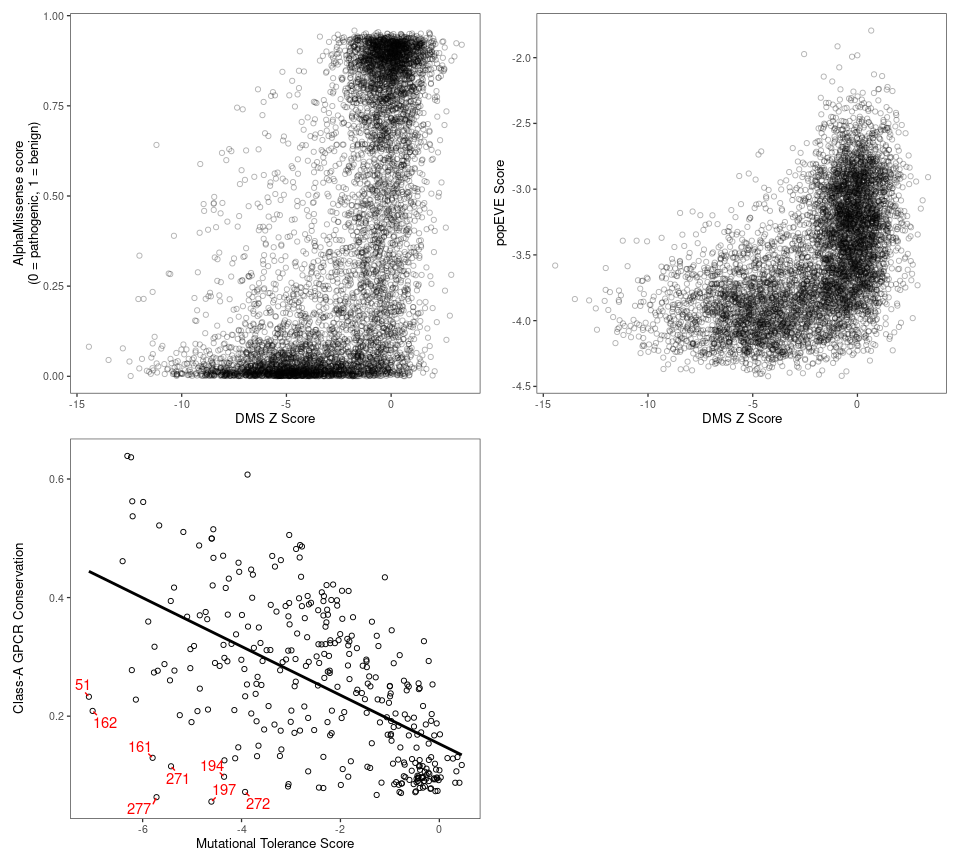
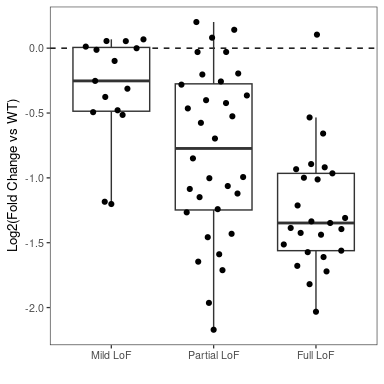

MC4R Figure Generation
================
Nathan Abell and Nathan Lubock
February 16, 2024

# Introduction

This document will recreate all of the figures for the manuscript.
Extended figures are included in the same directory as their
corresponding main figures for clarity.

But first, a little data munging to get everything annotated an
consistent.

# Figure 1

## Main Figures

## Extended Figures

### Effect of Barcodes

<!-- -->

### Correlation to Computational Predictions

<!-- -->

# Figure 2

## Main Figures

### aMSH Heatmap

Let’s split the protein up in two and use patchwork to smash it together

<!-- -->

### ClinVar

<!-- -->

### gnomAD

<!-- -->

### Literature Mutants

<!-- -->

### Delta EC50s from Literature

<!-- -->

### Variant Classification

<!-- -->

## Extended Figures

### aMSH Heatmap (Log2FC)

<!-- -->

### Show of Force (Z’s)

<!-- -->

### Show of Force (Log2FC)

<!-- -->

# Figure 3

## Main Figures

### PCA for Bias

<!-- -->

### Specific Mutants

<!-- -->

<!-- -->

## Extended Figures

### Bias PCA with Stops

<!-- -->

### Bias PCA with Loadings

<!-- -->

### Write TSV out for Structure

We’ll also write out the PC’s for projecting onto the structure
