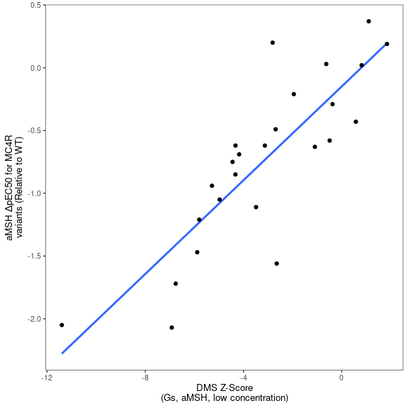
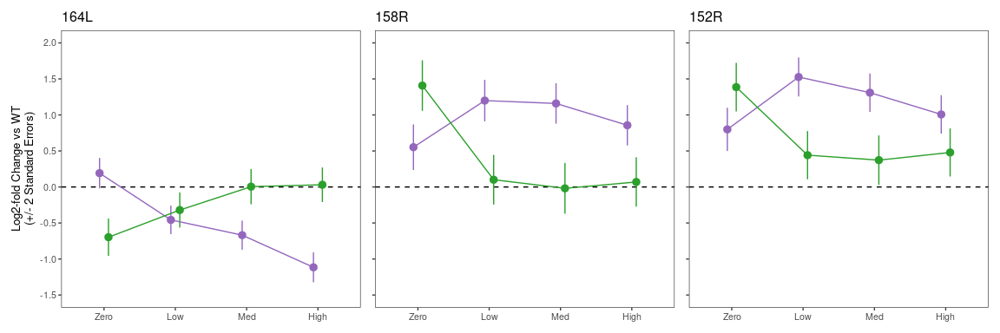
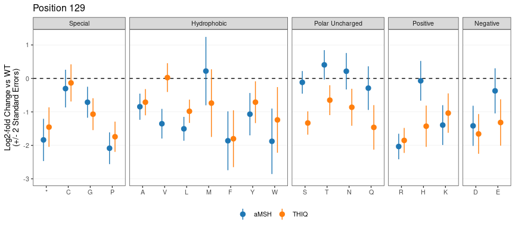
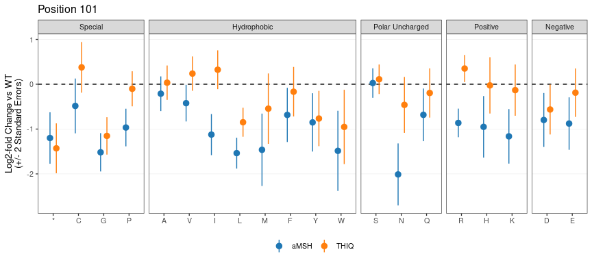

MC4R Figure Generation
================
Nathan Abell and Nathan Lubock
February 16, 2024

# Introduction

This document will recreate all of the figures for the manuscript.
Extended figures are included in the same directory as their
corresponding main figures for clarity.

But first, a little data munging to get everything annotated an
consistent.

# Figure 1

## Main Figures

## Extended Figures

### Effect of Barcodes

<!-- -->

### Correlation to Computational Predictions

<!-- -->

# Figure 2

## Main Figures

### aMSH Heatmap

Let’s split the protein up in two and use patchwork to smash it together

<!-- -->

### ClinVar

<!-- -->

### gnomAD

<!-- -->

### Literature Mutants

<!-- -->

### Delta EC50s from Literature

<!-- -->

### Variant Classification

<!-- -->

## Extended Figures

### aMSH Heatmap (Log2FC)

<!-- -->

### Show of Force (Z’s)

<!-- -->

### Show of Force (Log2FC)

<!-- -->

# Figure 3

## Main Figures

### PCA for Bias

<!-- -->

### Specific Mutants

<!-- -->

<!-- -->

## Extended Figures

### Bias PCA with Stops

<!-- -->

### Bias PCA with Loadings

<!-- -->

### Write TSV out for Structure

We’ll also write out the PC’s for projecting onto the structure

### More Biased Residue Zooms

<!-- -->

### 79 Zoom

<!-- -->

# Figure 4

# Figure 5

## Main Figures

### THIQ vs aMSH meta-regression

    ## process    real 
    ##   8.14s   1.99m

<!-- -->

As a table, here’s the 5% FDR’s

| pos | aa  | est_aMSH | est_THIQ | residual_z | residual_fdr |
|----:|:----|---------:|---------:|-----------:|-------------:|
|  43 | V   |    -0.44 |     0.27 |      -3.61 |         1.32 |
|  46 | R   |    -0.67 |     0.11 |      -5.06 |         3.56 |
|  48 | R   |    -1.06 |    -0.25 |      -4.78 |         3.15 |
|  48 | D   |     0.34 |    -0.49 |       3.79 |         1.55 |
|  50 | P   |    -0.62 |     0.07 |      -3.98 |         1.78 |
|  51 | S   |    -1.06 |    -0.24 |      -4.84 |         3.19 |
|  51 | L   |    -0.98 |    -0.30 |      -3.70 |         1.43 |
|  52 | S   |    -0.87 |    -0.10 |      -5.49 |         4.18 |
|  52 | G   |    -0.72 |     0.05 |      -4.61 |         2.84 |
|  52 | A   |    -0.70 |     0.10 |      -3.85 |         1.61 |
|  52 | T   |    -0.92 |    -0.09 |      -3.85 |         1.61 |
|  96 | L   |    -1.03 |     0.02 |      -3.67 |         1.39 |
| 101 | R   |    -0.88 |     0.36 |      -5.25 |         3.85 |
| 101 | I   |    -1.10 |     0.33 |      -4.16 |         1.99 |
| 104 | V   |    -1.35 |     0.14 |      -4.92 |         3.32 |
| 104 | R   |    -1.46 |    -0.26 |      -4.02 |         1.79 |
| 104 | G   |    -1.25 |     0.03 |      -3.97 |         1.78 |
| 104 | S   |    -1.13 |     0.35 |      -3.64 |         1.36 |
| 106 | R   |    -1.25 |    -0.25 |      -3.86 |         1.61 |
| 107 | G   |    -1.26 |    -0.13 |      -4.83 |         3.19 |
| 107 | A   |    -0.94 |    -0.07 |      -3.74 |         1.47 |
| 107 | R   |    -0.91 |    -0.12 |      -3.72 |         1.46 |
| 121 | P   |    -1.68 |     0.19 |      -5.79 |         4.82 |
| 123 | V   |    -1.94 |    -0.03 |      -5.19 |         3.80 |
| 123 | P   |    -1.43 |     0.02 |      -3.81 |         1.57 |
| 127 | G   |    -1.26 |     0.18 |      -4.04 |         1.81 |
| 127 | L   |    -1.62 |    -0.42 |      -3.72 |         1.46 |
| 129 | V   |    -1.36 |     0.01 |      -3.82 |         1.58 |
| 129 | T   |     0.39 |    -0.67 |       3.60 |         1.32 |
| 129 | H   |    -0.12 |    -1.47 |       3.61 |         1.32 |
| 129 | S   |    -0.11 |    -1.35 |       5.84 |         4.82 |
| 130 | S   |    -1.63 |     0.11 |      -5.41 |         4.15 |
| 185 | M   |    -1.55 |     0.11 |      -4.50 |         2.62 |
| 188 | R   |    -1.44 |     0.21 |      -4.16 |         1.99 |
| 188 | M   |    -1.66 |    -0.04 |      -3.94 |         1.73 |
| 189 | P   |    -1.36 |     0.39 |      -4.82 |         3.19 |
| 193 | F   |    -1.10 |     0.44 |      -4.07 |         1.85 |
| 194 | F   |    -1.62 |     0.24 |      -5.18 |         3.80 |
| 194 | Y   |    -1.28 |     0.17 |      -3.99 |         1.78 |
| 272 | R   |    -1.14 |    -0.02 |      -5.45 |         4.17 |
| 281 | R   |    -0.81 |     0.05 |      -4.94 |         3.33 |
| 284 | L   |    -1.03 |     0.25 |      -7.92 |        10.83 |
| 285 | R   |    -0.74 |     0.08 |      -4.72 |         3.03 |
| 292 | E   |    -1.05 |     0.12 |      -3.97 |         1.78 |

### aMSH vs THIQ – Position 129

<!-- -->

### aMSH vs THIQ – Position 284

<!-- -->

## Extended Figures

### PCA for ligand selectivity

<!-- -->

### aMSH vs THIQ – Position 48

<!-- -->

### DRC aMSH vs Thiq – Position 48

<!-- -->

### aMSH vs THIQ – Position 52

<!-- -->

### DRC aMSH vs THIQ – Position 52

<!-- -->

### aMSH vs THIQ – Position 101

<!-- -->

### DRC aMSH vs THIQ – Position 101

<!-- -->

### DRC aMSH vs THIQ – Position 129

<!-- -->

### DRC aMSH vs THIQ – Position 284

<!-- -->
