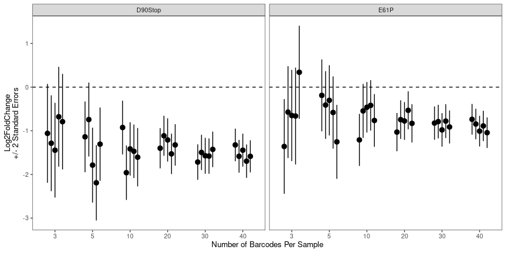
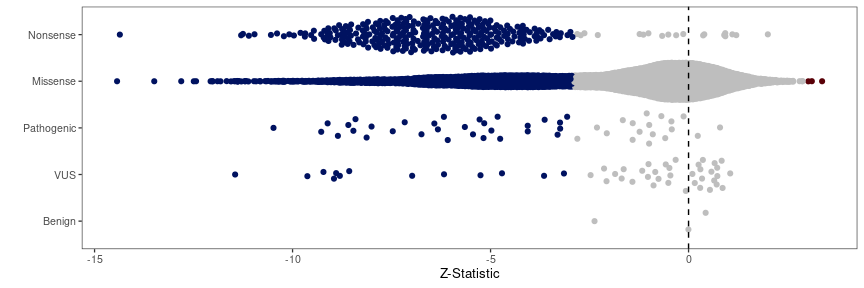
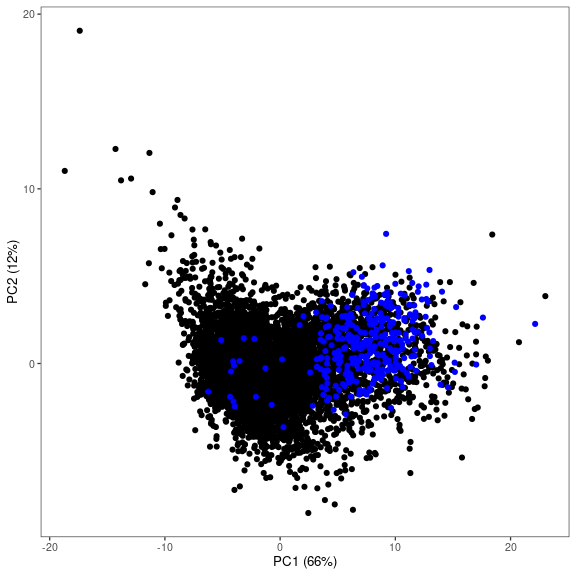
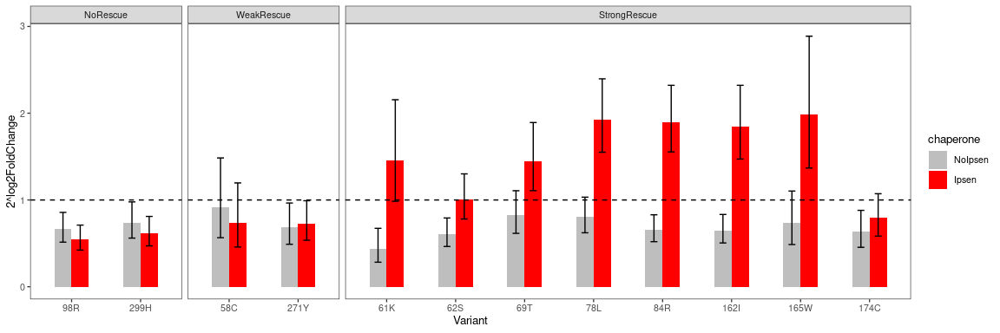
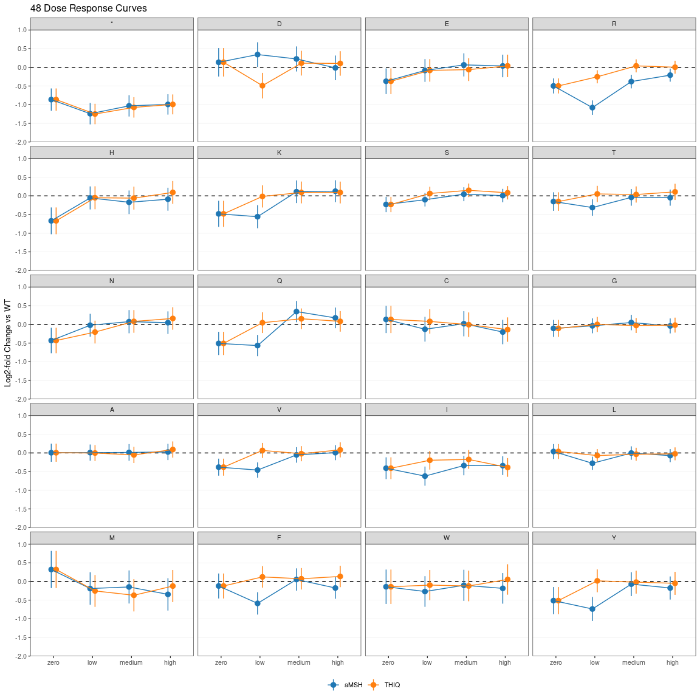
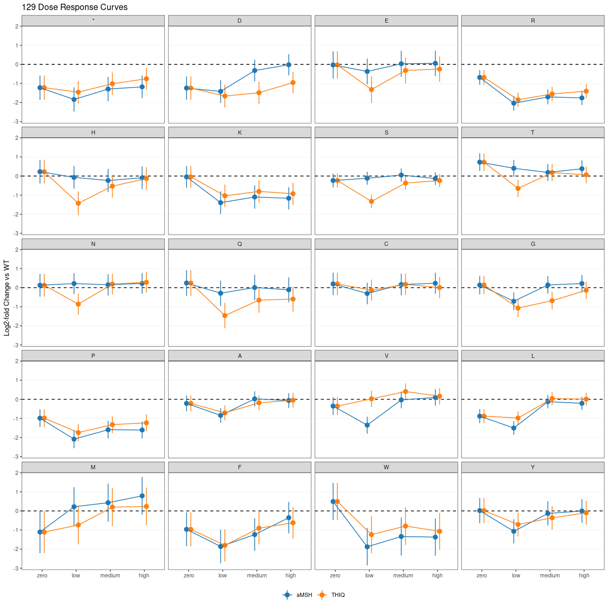
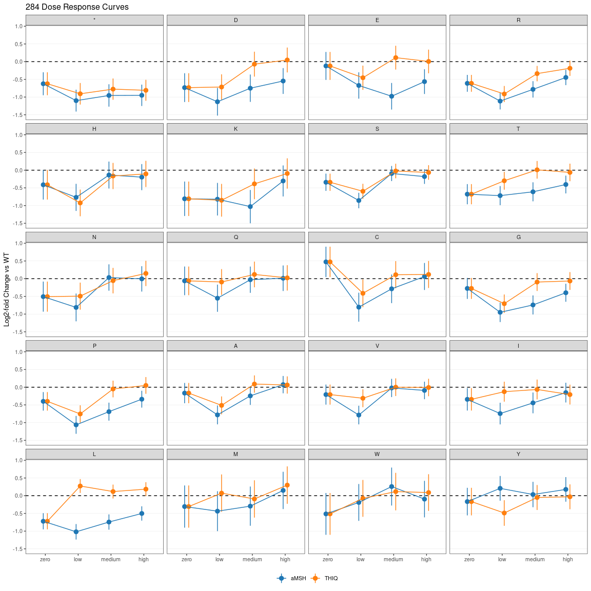

MC4R Figure Generation
================
Nathan Abell and Nathan Lubock
April 16, 2024

# Introduction

This document will recreate all of the figures for the manuscript.
Extended figures are included in the same directory as their
corresponding main figures for clarity.

But first, a little data munging to get everything annotated an
consistent.

# Figure 1

## Main Figures

## Extended Figures

### Library Dosing

    ##  Family: gaussian 
    ##   Links: mu = identity; sigma = identity 
    ## Formula: fold ~ 1 + (emax - 1)/(1 + 10^(slope * (ec50 - log10(conc)))) 
    ##          ec50 ~ -1 + drug
    ##          emax ~ 1
    ##          slope ~ 1
    ##    Data: library_luci_norm %>% filter(reporter == "Gs") (Number of observations: 88) 
    ##   Draws: 4 chains, each with iter = 2000; warmup = 1000; thin = 1;
    ##          total post-warmup draws = 4000
    ## 
    ## Regression Coefficients:
    ##                 Estimate Est.Error l-95% CI u-95% CI Rhat Bulk_ESS Tail_ESS
    ## ec50_drugaMSH      -9.99      0.10   -10.21    -9.82 1.00     3438     2453
    ## ec50_drugTHIQ      -8.03      0.10    -8.20    -7.82 1.00     2505     2857
    ## emax_Intercept      3.35      0.06     3.23     3.47 1.00     2866     3001
    ## slope_Intercept     1.10      0.18     0.78     1.50 1.00     2567     2641
    ## 
    ## Further Distributional Parameters:
    ##       Estimate Est.Error l-95% CI u-95% CI Rhat Bulk_ESS Tail_ESS
    ## sigma     0.34      0.03     0.29     0.40 1.00     4002     2533
    ## 
    ## Draws were sampled using sampling(NUTS). For each parameter, Bulk_ESS
    ## and Tail_ESS are effective sample size measures, and Rhat is the potential
    ## scale reduction factor on split chains (at convergence, Rhat = 1).

Same thing for Gq

    ##  Family: gaussian 
    ##   Links: mu = identity; sigma = identity 
    ## Formula: fold ~ 1 + (emax - 1)/(1 + 10^(slope * (ec50 - log10(conc)))) 
    ##          ec50 ~ -1 + drug
    ##          emax ~ 1
    ##          slope ~ 1
    ##    Data: library_luci_norm %>% filter(reporter == "Gq") (Number of observations: 88) 
    ##   Draws: 4 chains, each with iter = 2000; warmup = 1000; thin = 1;
    ##          total post-warmup draws = 4000
    ## 
    ## Regression Coefficients:
    ##                 Estimate Est.Error l-95% CI u-95% CI Rhat Bulk_ESS Tail_ESS
    ## ec50_drugaMSH      -7.58      0.13    -7.82    -7.29 1.00     1131     1287
    ## ec50_drugTHIQ      -5.86      0.15    -6.16    -5.55 1.00     1478     1474
    ## emax_Intercept      2.92      0.09     2.74     3.12 1.00     1224     1413
    ## slope_Intercept     0.51      0.05     0.42     0.61 1.00     1231     1578
    ## 
    ## Further Distributional Parameters:
    ##       Estimate Est.Error l-95% CI u-95% CI Rhat Bulk_ESS Tail_ESS
    ## sigma     0.16      0.01     0.14     0.18 1.00     2351     2391
    ## 
    ## Draws were sampled using sampling(NUTS). For each parameter, Bulk_ESS
    ## and Tail_ESS are effective sample size measures, and Rhat is the potential
    ## scale reduction factor on split chains (at convergence, Rhat = 1).

Now let’s plot the predictions together!

<!-- -->

### Effect of Barcodes

<!-- -->

### Correlation to Computational Predictions

<!-- -->

Write out aMSH data for both pathways with various predictors

# Figure 2

## Main Figures

### aMSH Heatmap Split

Let’s split the protein up in two and use patchwork to smash it together

<!-- -->

### aMSH Heatmap Long

<!-- -->

### Example Heatmaps

<!-- -->

### ClinVar

<!-- -->

### gnomAD

<!-- -->

### Literature Mutants

<!-- -->

### Delta EC50s from Literature

<!-- -->

### Variant Classification

<!-- -->

## Patchwork

<!-- -->

## Extended Figures

### aMSH Heatmap (Log2FC)

<!-- -->

### Show of Force (Z’s)

<!-- -->

### Show of Force (Log2FC)

<!-- -->

# Figure 3

## Main Figures

### PCA for Bias

<!-- -->

### Specific Mutants

<!-- -->

<!-- -->

### Patchwork

<!-- -->

## Extended Figures

### Bias PCA with Stops

<!-- -->

### Bias PCA with Loadings

<!-- -->

### Write TSV out for Structure

We’ll also write out the PC’s for projecting onto the structure

### More Biased Residue Zooms

<!-- -->

### 79 al

<!-- -->

### 79 zoom

<!-- -->

# Figure 4

## Main Figures

### Scaled (0-1) Rescue Effects Across All Variants

<!-- -->

### Custom Variant Set

<!-- -->

### Wang 2014 Variants

<!-- -->

<!-- -->

### Huang 2017 Variants

<!-- -->

<!-- -->

## Extended Figures

### Rescue/Defect Effects Across All Variants

<!-- -->

### Rescue/Defect Z-Statistics Across All Variants

<!-- -->

# Figure 5

## Main Figures

### THIQ vs aMSH meta-regression

    ## Running MCMC with 4 parallel chains...
    ## 
    ## Chain 1 Iteration:    1 / 2000 [  0%]  (Warmup) 
    ## Chain 2 Iteration:    1 / 2000 [  0%]  (Warmup) 
    ## Chain 3 Iteration:    1 / 2000 [  0%]  (Warmup) 
    ## Chain 4 Iteration:    1 / 2000 [  0%]  (Warmup) 
    ## Chain 1 Iteration:  100 / 2000 [  5%]  (Warmup) 
    ## Chain 2 Iteration:  100 / 2000 [  5%]  (Warmup) 
    ## Chain 3 Iteration:  100 / 2000 [  5%]  (Warmup) 
    ## Chain 4 Iteration:  100 / 2000 [  5%]  (Warmup) 
    ## Chain 2 Iteration:  200 / 2000 [ 10%]  (Warmup) 
    ## Chain 3 Iteration:  200 / 2000 [ 10%]  (Warmup) 
    ## Chain 2 Iteration:  300 / 2000 [ 15%]  (Warmup) 
    ## Chain 3 Iteration:  300 / 2000 [ 15%]  (Warmup) 
    ## Chain 4 Iteration:  200 / 2000 [ 10%]  (Warmup) 
    ## Chain 2 Iteration:  400 / 2000 [ 20%]  (Warmup) 
    ## Chain 3 Iteration:  400 / 2000 [ 20%]  (Warmup) 
    ## Chain 1 Iteration:  200 / 2000 [ 10%]  (Warmup) 
    ## Chain 4 Iteration:  300 / 2000 [ 15%]  (Warmup) 
    ## Chain 2 Iteration:  500 / 2000 [ 25%]  (Warmup) 
    ## Chain 3 Iteration:  500 / 2000 [ 25%]  (Warmup) 
    ## Chain 1 Iteration:  300 / 2000 [ 15%]  (Warmup) 
    ## Chain 4 Iteration:  400 / 2000 [ 20%]  (Warmup) 
    ## Chain 2 Iteration:  600 / 2000 [ 30%]  (Warmup) 
    ## Chain 3 Iteration:  600 / 2000 [ 30%]  (Warmup) 
    ## Chain 1 Iteration:  400 / 2000 [ 20%]  (Warmup) 
    ## Chain 2 Iteration:  700 / 2000 [ 35%]  (Warmup) 
    ## Chain 3 Iteration:  700 / 2000 [ 35%]  (Warmup) 
    ## Chain 4 Iteration:  500 / 2000 [ 25%]  (Warmup) 
    ## Chain 1 Iteration:  500 / 2000 [ 25%]  (Warmup) 
    ## Chain 2 Iteration:  800 / 2000 [ 40%]  (Warmup) 
    ## Chain 3 Iteration:  800 / 2000 [ 40%]  (Warmup) 
    ## Chain 4 Iteration:  600 / 2000 [ 30%]  (Warmup) 
    ## Chain 2 Iteration:  900 / 2000 [ 45%]  (Warmup) 
    ## Chain 3 Iteration:  900 / 2000 [ 45%]  (Warmup) 
    ## Chain 1 Iteration:  600 / 2000 [ 30%]  (Warmup) 
    ## Chain 4 Iteration:  700 / 2000 [ 35%]  (Warmup) 
    ## Chain 1 Iteration:  700 / 2000 [ 35%]  (Warmup) 
    ## Chain 2 Iteration: 1000 / 2000 [ 50%]  (Warmup) 
    ## Chain 2 Iteration: 1001 / 2000 [ 50%]  (Sampling) 
    ## Chain 4 Iteration:  800 / 2000 [ 40%]  (Warmup) 
    ## Chain 3 Iteration: 1000 / 2000 [ 50%]  (Warmup) 
    ## Chain 3 Iteration: 1001 / 2000 [ 50%]  (Sampling) 
    ## Chain 1 Iteration:  800 / 2000 [ 40%]  (Warmup) 
    ## Chain 4 Iteration:  900 / 2000 [ 45%]  (Warmup) 
    ## Chain 2 Iteration: 1100 / 2000 [ 55%]  (Sampling) 
    ## Chain 3 Iteration: 1100 / 2000 [ 55%]  (Sampling) 
    ## Chain 1 Iteration:  900 / 2000 [ 45%]  (Warmup) 
    ## Chain 4 Iteration: 1000 / 2000 [ 50%]  (Warmup) 
    ## Chain 4 Iteration: 1001 / 2000 [ 50%]  (Sampling) 
    ## Chain 2 Iteration: 1200 / 2000 [ 60%]  (Sampling) 
    ## Chain 3 Iteration: 1200 / 2000 [ 60%]  (Sampling) 
    ## Chain 1 Iteration: 1000 / 2000 [ 50%]  (Warmup) 
    ## Chain 1 Iteration: 1001 / 2000 [ 50%]  (Sampling) 
    ## Chain 4 Iteration: 1100 / 2000 [ 55%]  (Sampling) 
    ## Chain 2 Iteration: 1300 / 2000 [ 65%]  (Sampling) 
    ## Chain 3 Iteration: 1300 / 2000 [ 65%]  (Sampling) 
    ## Chain 1 Iteration: 1100 / 2000 [ 55%]  (Sampling) 
    ## Chain 4 Iteration: 1200 / 2000 [ 60%]  (Sampling) 
    ## Chain 2 Iteration: 1400 / 2000 [ 70%]  (Sampling) 
    ## Chain 3 Iteration: 1400 / 2000 [ 70%]  (Sampling) 
    ## Chain 1 Iteration: 1200 / 2000 [ 60%]  (Sampling) 
    ## Chain 4 Iteration: 1300 / 2000 [ 65%]  (Sampling) 
    ## Chain 2 Iteration: 1500 / 2000 [ 75%]  (Sampling) 
    ## Chain 3 Iteration: 1500 / 2000 [ 75%]  (Sampling) 
    ## Chain 1 Iteration: 1300 / 2000 [ 65%]  (Sampling) 
    ## Chain 4 Iteration: 1400 / 2000 [ 70%]  (Sampling) 
    ## Chain 2 Iteration: 1600 / 2000 [ 80%]  (Sampling) 
    ## Chain 3 Iteration: 1600 / 2000 [ 80%]  (Sampling) 
    ## Chain 1 Iteration: 1400 / 2000 [ 70%]  (Sampling) 
    ## Chain 4 Iteration: 1500 / 2000 [ 75%]  (Sampling) 
    ## Chain 2 Iteration: 1700 / 2000 [ 85%]  (Sampling) 
    ## Chain 3 Iteration: 1700 / 2000 [ 85%]  (Sampling) 
    ## Chain 1 Iteration: 1500 / 2000 [ 75%]  (Sampling) 
    ## Chain 4 Iteration: 1600 / 2000 [ 80%]  (Sampling) 
    ## Chain 2 Iteration: 1800 / 2000 [ 90%]  (Sampling) 
    ## Chain 3 Iteration: 1800 / 2000 [ 90%]  (Sampling) 
    ## Chain 1 Iteration: 1600 / 2000 [ 80%]  (Sampling) 
    ## Chain 4 Iteration: 1700 / 2000 [ 85%]  (Sampling) 
    ## Chain 2 Iteration: 1900 / 2000 [ 95%]  (Sampling) 
    ## Chain 3 Iteration: 1900 / 2000 [ 95%]  (Sampling) 
    ## Chain 1 Iteration: 1700 / 2000 [ 85%]  (Sampling) 
    ## Chain 4 Iteration: 1800 / 2000 [ 90%]  (Sampling) 
    ## Chain 2 Iteration: 2000 / 2000 [100%]  (Sampling) 
    ## Chain 2 finished in 105.2 seconds.
    ## Chain 3 Iteration: 2000 / 2000 [100%]  (Sampling) 
    ## Chain 3 finished in 105.5 seconds.
    ## Chain 1 Iteration: 1800 / 2000 [ 90%]  (Sampling) 
    ## Chain 4 Iteration: 1900 / 2000 [ 95%]  (Sampling) 
    ## Chain 1 Iteration: 1900 / 2000 [ 95%]  (Sampling) 
    ## Chain 4 Iteration: 2000 / 2000 [100%]  (Sampling) 
    ## Chain 4 finished in 110.1 seconds.
    ## Chain 1 Iteration: 2000 / 2000 [100%]  (Sampling) 
    ## Chain 1 finished in 112.0 seconds.
    ## 
    ## All 4 chains finished successfully.
    ## Mean chain execution time: 108.2 seconds.
    ## Total execution time: 112.2 seconds.

    ## process    real 
    ##  13.83s   2.49m

<!-- -->

As a table, here’s the 5% FDR’s

| pos | aa  | est_aMSH | est_THIQ | residual_z | residual_fdr |
|----:|:----|---------:|---------:|-----------:|-------------:|
|  43 | V   |    -0.45 |     0.27 |      -3.68 |         1.43 |
|  46 | R   |    -0.67 |     0.10 |      -4.93 |         3.43 |
|  48 | R   |    -1.08 |    -0.25 |      -4.98 |         3.46 |
|  48 | D   |     0.34 |    -0.49 |       3.82 |         1.61 |
|  50 | P   |    -0.61 |     0.08 |      -3.95 |         1.74 |
|  51 | S   |    -1.11 |    -0.21 |      -5.67 |         4.73 |
|  51 | L   |    -1.01 |    -0.30 |      -3.86 |         1.65 |
|  52 | S   |    -0.90 |    -0.09 |      -5.69 |         4.73 |
|  52 | G   |    -0.73 |     0.05 |      -4.69 |         3.01 |
|  52 | A   |    -0.71 |     0.10 |      -3.88 |         1.67 |
|  52 | T   |    -0.93 |    -0.10 |      -3.78 |         1.56 |
|  96 | L   |    -1.01 |     0.06 |      -3.74 |         1.51 |
| 101 | R   |    -0.86 |     0.35 |      -4.96 |         3.45 |
| 101 | I   |    -1.12 |     0.32 |      -4.09 |         1.92 |
| 104 | V   |    -1.40 |     0.13 |      -4.99 |         3.46 |
| 104 | R   |    -1.48 |    -0.27 |      -4.14 |         1.95 |
| 104 | G   |    -1.27 |     0.03 |      -4.09 |         1.92 |
| 104 | S   |    -1.12 |     0.35 |      -3.60 |         1.33 |
| 106 | R   |    -1.25 |    -0.26 |      -3.90 |         1.68 |
| 107 | G   |    -1.27 |    -0.13 |      -4.95 |         3.45 |
| 107 | A   |    -0.95 |    -0.07 |      -3.83 |         1.62 |
| 107 | R   |    -0.91 |    -0.12 |      -3.69 |         1.43 |
| 121 | P   |    -1.69 |     0.24 |      -5.88 |         4.90 |
| 123 | V   |    -1.92 |    -0.03 |      -5.12 |         3.68 |
| 123 | P   |    -1.44 |     0.01 |      -3.82 |         1.61 |
| 127 | G   |    -1.25 |     0.19 |      -4.09 |         1.92 |
| 127 | L   |    -1.65 |    -0.39 |      -4.02 |         1.85 |
| 129 | V   |    -1.35 |     0.02 |      -3.88 |         1.67 |
| 129 | H   |    -0.07 |    -1.43 |       3.63 |         1.37 |
| 129 | T   |     0.41 |    -0.65 |       3.73 |         1.49 |
| 129 | S   |    -0.12 |    -1.33 |       5.83 |         4.90 |
| 130 | S   |    -1.64 |     0.12 |      -5.58 |         4.57 |
| 185 | M   |    -1.47 |     0.12 |      -4.22 |         2.10 |
| 188 | R   |    -1.44 |     0.20 |      -4.25 |         2.13 |
| 188 | M   |    -1.66 |    -0.04 |      -3.99 |         1.80 |
| 189 | P   |    -1.37 |     0.41 |      -4.78 |         3.17 |
| 193 | F   |    -1.10 |     0.46 |      -4.04 |         1.85 |
| 194 | F   |    -1.61 |     0.25 |      -5.26 |         3.92 |
| 194 | Y   |    -1.29 |     0.18 |      -4.03 |         1.85 |
| 272 | R   |    -1.10 |    -0.03 |      -5.23 |         3.90 |
| 281 | R   |    -0.83 |     0.07 |      -5.43 |         4.26 |
| 282 | L   |    -0.63 |     0.03 |      -3.67 |         1.43 |
| 284 | L   |    -1.02 |     0.27 |      -8.07 |        11.35 |
| 285 | R   |    -0.74 |     0.10 |      -4.80 |         3.17 |
| 292 | E   |    -1.01 |     0.14 |      -3.91 |         1.70 |

### aMSH vs THIQ – Position 129

<!-- -->

### aMSH vs THIQ – Position 104

<!-- -->

### aMSH vs THIQ – Position 48

<!-- -->

### Patchwork

<!-- -->

## Extended Figures

### PCA for ligand selectivity

<!-- -->

### DRC aMSH vs Thiq – Position 48

<!-- -->

### aMSH vs THIQ – Position 52

<!-- -->

### DRC aMSH vs THIQ – Position 52

<!-- -->

### aMSH vs THIQ – Position 101

<!-- -->

### DRC aMSH vs THIQ – Position 101

<!-- -->

### DRC aMSH vs THIQ – Position 104

<!-- -->

### DRC aMSH vs THIQ – Position 129

<!-- -->

### aMSH vs THIQ – Position 284

<!-- -->

### DRC aMSH vs THIQ – Position 284

<!-- -->
