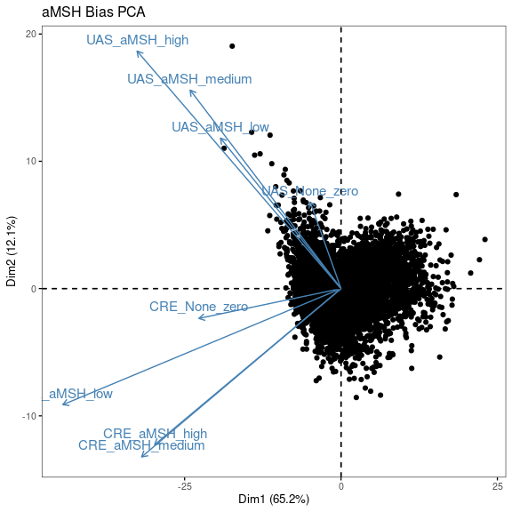
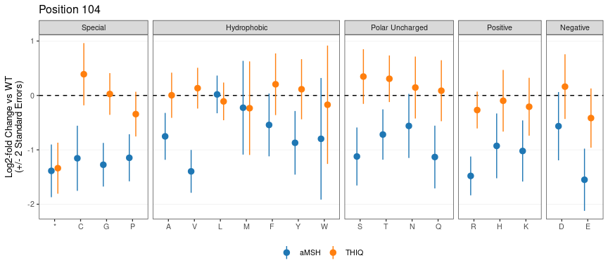
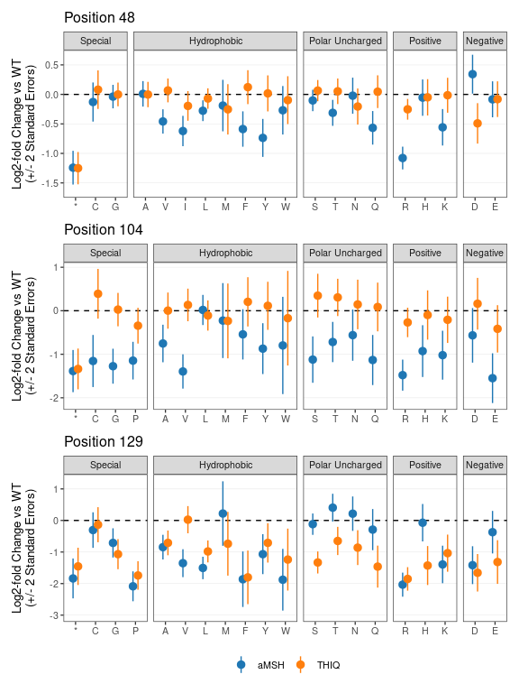
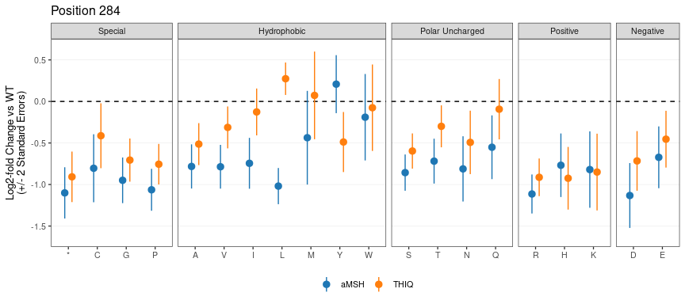

MC4R Figure Generation
================
Nathan Abell and Nathan Lubock
March 14, 2024

# Introduction

This document will recreate all of the figures for the manuscript.
Extended figures are included in the same directory as their
corresponding main figures for clarity.

But first, a little data munging to get everything annotated an
consistent.

# Figure 1

## Main Figures

## Extended Figures

### Effect of Barcodes

<!-- -->

### Correlation to Computational Predictions

<!-- -->

Write out aMSH data for both pathways with various predictors

# Figure 2

## Main Figures

### aMSH Heatmap Split

Let’s split the protein up in two and use patchwork to smash it together

<!-- -->

### aMSH Heatmap Long

<!-- -->

### Example Heatmaps

<!-- -->

### ClinVar

<!-- -->

### gnomAD

<!-- -->

### Literature Mutants

<!-- -->

### Delta EC50s from Literature

<!-- -->

### Variant Classification

<!-- -->

## Patchwork

<!-- -->

## Extended Figures

### aMSH Heatmap (Log2FC)

<!-- -->

### Show of Force (Z’s)

<!-- -->

### Show of Force (Log2FC)

<!-- -->

# Figure 3

## Main Figures

### PCA for Bias

<!-- -->

### Specific Mutants

<!-- -->

<!-- -->

### Patchwork

<!-- -->

## Extended Figures

### Bias PCA with Stops

<!-- -->

### Bias PCA with Loadings

<!-- -->

### Write TSV out for Structure

We’ll also write out the PC’s for projecting onto the structure

### More Biased Residue Zooms

<!-- -->

### 79 al

<!-- -->

### 79 zoom

<!-- -->

# Figure 4

## Main Figures

### Scaled (0-1) Rescue Effects Across All Variants

<!-- -->

### Custom Variant Set

<!-- -->

### Wang 2014 Variants

<!-- -->

<!-- -->

### Huang 2017 Variants

<!-- -->

<!-- -->

## Extended Figures

### Rescue/Defect Effects Across All Variants

<!-- -->

### Rescue/Defect Z-Statistics Across All Variants

<!-- -->

# Figure 5

## Main Figures

### THIQ vs aMSH meta-regression

    ## process    real 
    ##   8.08s   1.91m

<!-- -->

As a table, here’s the 5% FDR’s

| pos | aa  | est_aMSH | est_THIQ | residual_z | residual_fdr |
|----:|:----|---------:|---------:|-----------:|-------------:|
|  43 | V   |    -0.45 |     0.27 |      -3.68 |         1.42 |
|  46 | R   |    -0.67 |     0.10 |      -5.02 |         3.57 |
|  48 | R   |    -1.08 |    -0.25 |      -5.05 |         3.61 |
|  48 | D   |     0.34 |    -0.49 |       3.86 |         1.64 |
|  50 | P   |    -0.61 |     0.08 |      -3.96 |         1.74 |
|  51 | S   |    -1.11 |    -0.21 |      -5.69 |         4.77 |
|  51 | L   |    -1.01 |    -0.30 |      -3.76 |         1.53 |
|  52 | S   |    -0.90 |    -0.09 |      -5.84 |         5.05 |
|  52 | G   |    -0.73 |     0.05 |      -4.71 |         3.04 |
|  52 | A   |    -0.71 |     0.10 |      -3.90 |         1.69 |
|  52 | T   |    -0.93 |    -0.10 |      -3.75 |         1.53 |
|  96 | L   |    -1.01 |     0.06 |      -3.76 |         1.53 |
| 101 | R   |    -0.86 |     0.35 |      -5.05 |         3.61 |
| 101 | I   |    -1.12 |     0.32 |      -4.17 |         2.02 |
| 104 | V   |    -1.40 |     0.13 |      -4.94 |         3.42 |
| 104 | G   |    -1.27 |     0.03 |      -4.10 |         1.95 |
| 104 | R   |    -1.48 |    -0.27 |      -3.95 |         1.74 |
| 104 | S   |    -1.12 |     0.35 |      -3.65 |         1.40 |
| 106 | R   |    -1.25 |    -0.26 |      -3.79 |         1.54 |
| 107 | G   |    -1.27 |    -0.13 |      -4.86 |         3.28 |
| 107 | A   |    -0.95 |    -0.07 |      -3.79 |         1.54 |
| 107 | R   |    -0.91 |    -0.12 |      -3.70 |         1.45 |
| 121 | P   |    -1.69 |     0.24 |      -5.85 |         5.05 |
| 123 | V   |    -1.92 |    -0.03 |      -5.06 |         3.61 |
| 123 | P   |    -1.44 |     0.01 |      -3.78 |         1.54 |
| 127 | L   |    -1.65 |    -0.39 |      -4.14 |         1.98 |
| 127 | G   |    -1.25 |     0.19 |      -4.13 |         1.98 |
| 129 | V   |    -1.35 |     0.02 |      -3.85 |         1.62 |
| 129 | T   |     0.41 |    -0.65 |       3.63 |         1.37 |
| 129 | S   |    -0.12 |    -1.33 |       5.93 |         5.05 |
| 130 | S   |    -1.64 |     0.12 |      -5.51 |         4.40 |
| 151 | W   |    -3.99 |    -1.24 |      -3.60 |         1.33 |
| 185 | M   |    -1.47 |     0.12 |      -4.35 |         2.32 |
| 188 | R   |    -1.44 |     0.20 |      -4.27 |         2.19 |
| 188 | M   |    -1.66 |    -0.04 |      -3.91 |         1.70 |
| 189 | P   |    -1.37 |     0.41 |      -4.79 |         3.15 |
| 193 | F   |    -1.10 |     0.46 |      -4.05 |         1.87 |
| 194 | F   |    -1.61 |     0.25 |      -5.11 |         3.63 |
| 194 | Y   |    -1.29 |     0.18 |      -3.95 |         1.74 |
| 272 | R   |    -1.10 |    -0.03 |      -5.35 |         4.12 |
| 281 | R   |    -0.83 |     0.07 |      -5.34 |         4.12 |
| 282 | L   |    -0.63 |     0.03 |      -3.66 |         1.40 |
| 284 | L   |    -1.02 |     0.27 |      -7.83 |        10.47 |
| 285 | R   |    -0.74 |     0.10 |      -4.73 |         3.05 |
| 292 | E   |    -1.01 |     0.14 |      -3.96 |         1.74 |

### aMSH vs THIQ – Position 129

<!-- -->

### aMSH vs THIQ – Position 104

<!-- -->

### aMSH vs THIQ – Position 48

<!-- -->

### Patchwork

<!-- -->

## Extended Figures

### PCA for ligand selectivity

<!-- -->

### DRC aMSH vs Thiq – Position 48

<!-- -->

### aMSH vs THIQ – Position 52

<!-- -->

### DRC aMSH vs THIQ – Position 52

<!-- -->

### aMSH vs THIQ – Position 101

<!-- -->

### DRC aMSH vs THIQ – Position 101

<!-- -->

### DRC aMSH vs THIQ – Position 104

<!-- -->

### DRC aMSH vs THIQ – Position 129

<!-- -->

### aMSH vs THIQ – Position 284

<!-- -->

### DRC aMSH vs THIQ – Position 284

<!-- -->
