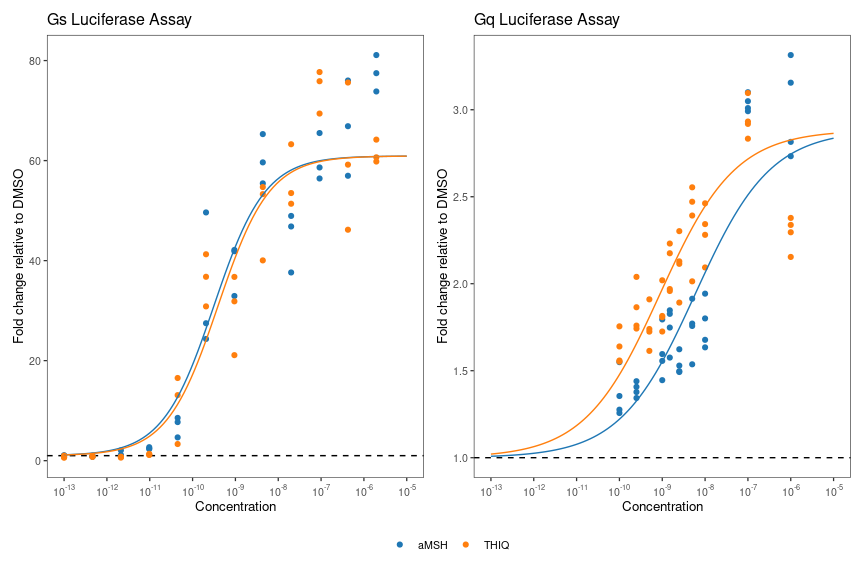
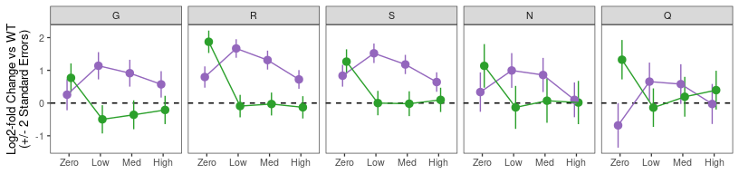
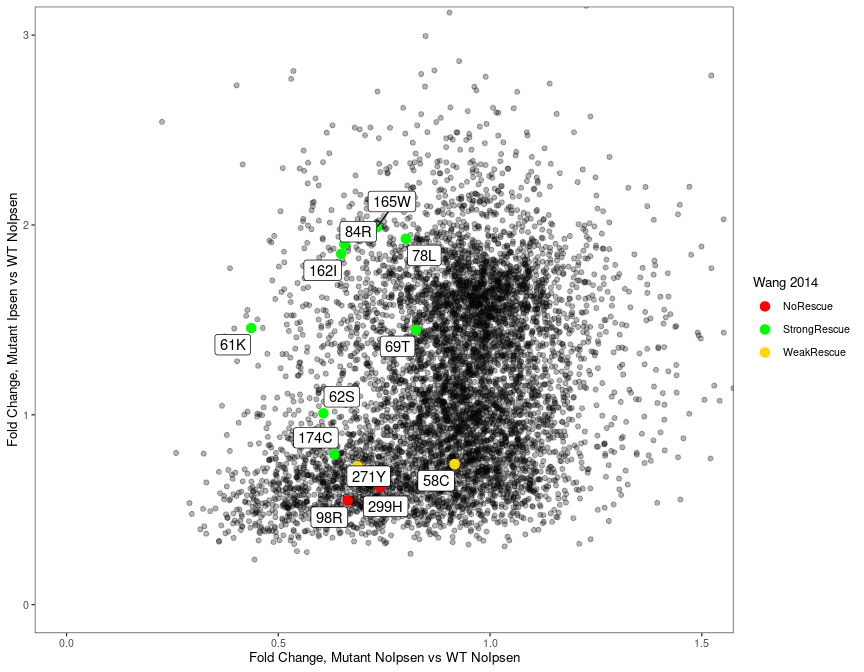
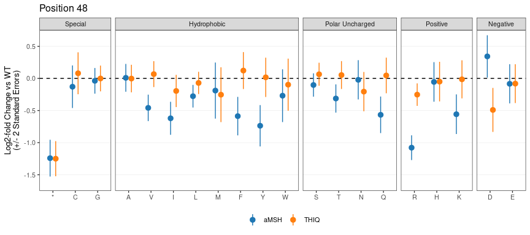
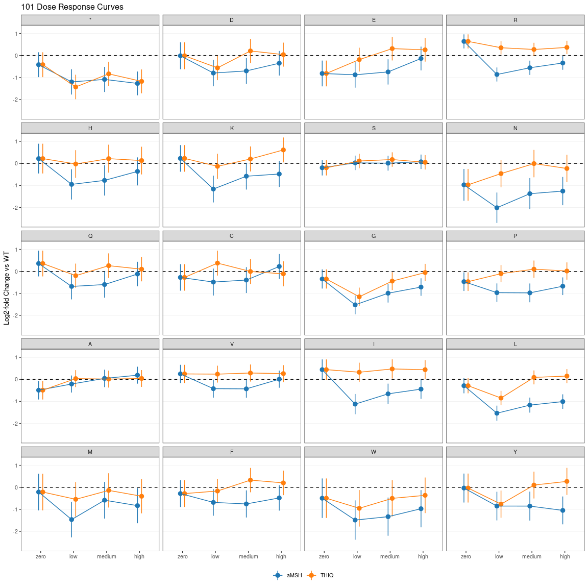

MC4R Figure Generation
================
Nathan Abell and Nathan Lubock
April 01, 2024

# Introduction

This document will recreate all of the figures for the manuscript.
Extended figures are included in the same directory as their
corresponding main figures for clarity.

But first, a little data munging to get everything annotated an
consistent.

# Figure 1

## Main Figures

## Extended Figures

### Library Dosing

<!-- -->

### Effect of Barcodes

<!-- -->

### Correlation to Computational Predictions

<!-- -->

Write out aMSH data for both pathways with various predictors

# Figure 2

## Main Figures

### aMSH Heatmap Split

Let’s split the protein up in two and use patchwork to smash it together

<!-- -->

### aMSH Heatmap Long

<!-- -->

### Example Heatmaps

<!-- -->

### ClinVar

<!-- -->

### gnomAD

<!-- -->

### Literature Mutants

<!-- -->

### Delta EC50s from Literature

<!-- -->

### Variant Classification

<!-- -->

## Patchwork

<!-- -->

## Extended Figures

### aMSH Heatmap (Log2FC)

<!-- -->

### Show of Force (Z’s)

<!-- -->

### Show of Force (Log2FC)

<!-- -->

# Figure 3

## Main Figures

### PCA for Bias

<!-- -->

### Specific Mutants

<!-- -->

<!-- -->

### Patchwork

<!-- -->

## Extended Figures

### Bias PCA with Stops

<!-- -->

### Bias PCA with Loadings

<!-- -->

### Write TSV out for Structure

We’ll also write out the PC’s for projecting onto the structure

### More Biased Residue Zooms

<!-- -->

### 79 al

<!-- -->

### 79 zoom

<!-- -->

# Figure 4

## Main Figures

### Scaled (0-1) Rescue Effects Across All Variants

<!-- -->

### Custom Variant Set

<!-- -->

### Wang 2014 Variants

<!-- -->

<!-- -->

### Huang 2017 Variants

<!-- -->

<!-- -->

## Extended Figures

### Rescue/Defect Effects Across All Variants

<!-- -->

### Rescue/Defect Z-Statistics Across All Variants

<!-- -->

# Figure 5

## Main Figures

### THIQ vs aMSH meta-regression

    ## Running MCMC with 4 parallel chains...
    ## 
    ## Chain 1 Iteration:    1 / 2000 [  0%]  (Warmup) 
    ## Chain 2 Iteration:    1 / 2000 [  0%]  (Warmup) 
    ## Chain 3 Iteration:    1 / 2000 [  0%]  (Warmup) 
    ## Chain 4 Iteration:    1 / 2000 [  0%]  (Warmup) 
    ## Chain 4 Iteration:  100 / 2000 [  5%]  (Warmup) 
    ## Chain 3 Iteration:  100 / 2000 [  5%]  (Warmup) 
    ## Chain 1 Iteration:  100 / 2000 [  5%]  (Warmup) 
    ## Chain 2 Iteration:  100 / 2000 [  5%]  (Warmup) 
    ## Chain 1 Iteration:  200 / 2000 [ 10%]  (Warmup) 
    ## Chain 2 Iteration:  200 / 2000 [ 10%]  (Warmup) 
    ## Chain 3 Iteration:  200 / 2000 [ 10%]  (Warmup) 
    ## Chain 1 Iteration:  300 / 2000 [ 15%]  (Warmup) 
    ## Chain 2 Iteration:  300 / 2000 [ 15%]  (Warmup) 
    ## Chain 3 Iteration:  300 / 2000 [ 15%]  (Warmup) 
    ## Chain 1 Iteration:  400 / 2000 [ 20%]  (Warmup) 
    ## Chain 2 Iteration:  400 / 2000 [ 20%]  (Warmup) 
    ## Chain 3 Iteration:  400 / 2000 [ 20%]  (Warmup) 
    ## Chain 1 Iteration:  500 / 2000 [ 25%]  (Warmup) 
    ## Chain 2 Iteration:  500 / 2000 [ 25%]  (Warmup) 
    ## Chain 3 Iteration:  500 / 2000 [ 25%]  (Warmup) 
    ## Chain 1 Iteration:  600 / 2000 [ 30%]  (Warmup) 
    ## Chain 2 Iteration:  600 / 2000 [ 30%]  (Warmup) 
    ## Chain 3 Iteration:  600 / 2000 [ 30%]  (Warmup) 
    ## Chain 1 Iteration:  700 / 2000 [ 35%]  (Warmup) 
    ## Chain 2 Iteration:  700 / 2000 [ 35%]  (Warmup) 
    ## Chain 3 Iteration:  700 / 2000 [ 35%]  (Warmup) 
    ## Chain 1 Iteration:  800 / 2000 [ 40%]  (Warmup) 
    ## Chain 2 Iteration:  800 / 2000 [ 40%]  (Warmup) 
    ## Chain 3 Iteration:  800 / 2000 [ 40%]  (Warmup) 
    ## Chain 1 Iteration:  900 / 2000 [ 45%]  (Warmup) 
    ## Chain 2 Iteration:  900 / 2000 [ 45%]  (Warmup) 
    ## Chain 3 Iteration:  900 / 2000 [ 45%]  (Warmup) 
    ## Chain 2 Iteration: 1000 / 2000 [ 50%]  (Warmup) 
    ## Chain 2 Iteration: 1001 / 2000 [ 50%]  (Sampling) 
    ## Chain 1 Iteration: 1000 / 2000 [ 50%]  (Warmup) 
    ## Chain 1 Iteration: 1001 / 2000 [ 50%]  (Sampling) 
    ## Chain 3 Iteration: 1000 / 2000 [ 50%]  (Warmup) 
    ## Chain 3 Iteration: 1001 / 2000 [ 50%]  (Sampling) 
    ## Chain 2 Iteration: 1100 / 2000 [ 55%]  (Sampling) 
    ## Chain 1 Iteration: 1100 / 2000 [ 55%]  (Sampling) 
    ## Chain 3 Iteration: 1100 / 2000 [ 55%]  (Sampling) 
    ## Chain 2 Iteration: 1200 / 2000 [ 60%]  (Sampling) 
    ## Chain 1 Iteration: 1200 / 2000 [ 60%]  (Sampling) 
    ## Chain 4 Iteration:  200 / 2000 [ 10%]  (Warmup) 
    ## Chain 3 Iteration: 1200 / 2000 [ 60%]  (Sampling) 
    ## Chain 2 Iteration: 1300 / 2000 [ 65%]  (Sampling) 
    ## Chain 1 Iteration: 1300 / 2000 [ 65%]  (Sampling) 
    ## Chain 4 Iteration:  300 / 2000 [ 15%]  (Warmup) 
    ## Chain 3 Iteration: 1300 / 2000 [ 65%]  (Sampling) 
    ## Chain 4 Iteration:  400 / 2000 [ 20%]  (Warmup) 
    ## Chain 2 Iteration: 1400 / 2000 [ 70%]  (Sampling) 
    ## Chain 1 Iteration: 1400 / 2000 [ 70%]  (Sampling) 
    ## Chain 3 Iteration: 1400 / 2000 [ 70%]  (Sampling) 
    ## Chain 4 Iteration:  500 / 2000 [ 25%]  (Warmup) 
    ## Chain 2 Iteration: 1500 / 2000 [ 75%]  (Sampling) 
    ## Chain 1 Iteration: 1500 / 2000 [ 75%]  (Sampling) 
    ## Chain 4 Iteration:  600 / 2000 [ 30%]  (Warmup) 
    ## Chain 3 Iteration: 1500 / 2000 [ 75%]  (Sampling) 
    ## Chain 2 Iteration: 1600 / 2000 [ 80%]  (Sampling) 
    ## Chain 1 Iteration: 1600 / 2000 [ 80%]  (Sampling) 
    ## Chain 4 Iteration:  700 / 2000 [ 35%]  (Warmup) 
    ## Chain 3 Iteration: 1600 / 2000 [ 80%]  (Sampling) 
    ## Chain 2 Iteration: 1700 / 2000 [ 85%]  (Sampling) 
    ## Chain 1 Iteration: 1700 / 2000 [ 85%]  (Sampling) 
    ## Chain 4 Iteration:  800 / 2000 [ 40%]  (Warmup) 
    ## Chain 3 Iteration: 1700 / 2000 [ 85%]  (Sampling) 
    ## Chain 4 Iteration:  900 / 2000 [ 45%]  (Warmup) 
    ## Chain 2 Iteration: 1800 / 2000 [ 90%]  (Sampling) 
    ## Chain 1 Iteration: 1800 / 2000 [ 90%]  (Sampling) 
    ## Chain 3 Iteration: 1800 / 2000 [ 90%]  (Sampling) 
    ## Chain 4 Iteration: 1000 / 2000 [ 50%]  (Warmup) 
    ## Chain 4 Iteration: 1001 / 2000 [ 50%]  (Sampling) 
    ## Chain 2 Iteration: 1900 / 2000 [ 95%]  (Sampling) 
    ## Chain 1 Iteration: 1900 / 2000 [ 95%]  (Sampling) 
    ## Chain 3 Iteration: 1900 / 2000 [ 95%]  (Sampling) 
    ## Chain 4 Iteration: 1100 / 2000 [ 55%]  (Sampling) 
    ## Chain 2 Iteration: 2000 / 2000 [100%]  (Sampling) 
    ## Chain 2 finished in 105.2 seconds.
    ## Chain 1 Iteration: 2000 / 2000 [100%]  (Sampling) 
    ## Chain 1 finished in 105.3 seconds.
    ## Chain 3 Iteration: 2000 / 2000 [100%]  (Sampling) 
    ## Chain 3 finished in 107.1 seconds.
    ## Chain 4 Iteration: 1200 / 2000 [ 60%]  (Sampling) 
    ## Chain 4 Iteration: 1300 / 2000 [ 65%]  (Sampling) 
    ## Chain 4 Iteration: 1400 / 2000 [ 70%]  (Sampling) 
    ## Chain 4 Iteration: 1500 / 2000 [ 75%]  (Sampling) 
    ## Chain 4 Iteration: 1600 / 2000 [ 80%]  (Sampling) 
    ## Chain 4 Iteration: 1700 / 2000 [ 85%]  (Sampling) 
    ## Chain 4 Iteration: 1800 / 2000 [ 90%]  (Sampling) 
    ## Chain 4 Iteration: 1900 / 2000 [ 95%]  (Sampling) 
    ## Chain 4 Iteration: 2000 / 2000 [100%]  (Sampling) 
    ## Chain 4 finished in 130.1 seconds.
    ## 
    ## All 4 chains finished successfully.
    ## Mean chain execution time: 111.9 seconds.
    ## Total execution time: 130.4 seconds.

    ## process    real 
    ##  14.29s   2.79m

<!-- -->

As a table, here’s the 5% FDR’s

| pos | aa  | est_aMSH | est_THIQ | residual_z | residual_fdr |
|----:|:----|---------:|---------:|-----------:|-------------:|
|  17 | W   |    -1.04 |     0.67 |      -3.89 |         1.38 |
|  97 | V   |    -0.57 |     1.21 |      -5.96 |         5.26 |
|  97 | A   |    -0.25 |     1.63 |      -5.59 |         4.42 |
|  97 | S   |    -0.18 |     1.11 |      -5.30 |         3.96 |
|  97 | T   |    -0.37 |     1.24 |      -5.15 |         3.73 |
| 101 | P   |    -0.74 |     1.19 |      -6.18 |         5.36 |
| 101 | R   |    -0.81 |     0.54 |      -5.97 |         5.26 |
| 104 | A   |    -0.11 |     1.00 |      -4.04 |         1.59 |
| 105 | L   |     0.56 |    -0.22 |       4.85 |         3.08 |
| 107 | R   |    -0.34 |     0.34 |      -4.01 |         1.57 |
| 118 | V   |     1.07 |    -0.06 |       4.65 |         2.73 |
| 119 | R   |     0.72 |    -0.32 |       4.72 |         2.85 |
| 131 | L   |    -0.47 |     0.76 |      -5.38 |         4.09 |
| 146 | L   |    -0.59 |     0.61 |      -5.40 |         4.09 |
| 146 | Q   |    -0.53 |     1.23 |      -4.57 |         2.61 |
| 254 | P   |     1.71 |     0.86 |       5.21 |         3.80 |

### aMSH vs THIQ – Position 129

<!-- -->

### aMSH vs THIQ – Position 97

<!-- -->

### aMSH vs THIQ – Position 104

<!-- -->

### aMSH vs THIQ – Position 254

<!-- -->

### aMSH vs THIQ – Position 48

<!-- -->

### Patchwork

<!-- -->

## Extended Figures

### PCA for ligand selectivity

<!-- -->

### DRC aMSH vs Thiq – Position 48

<!-- -->

### aMSH vs THIQ – Position 52

<!-- -->

### DRC aMSH vs THIQ – Position 52

<!-- -->

### aMSH vs THIQ – Position 101

<!-- -->

### DRC aMSH vs THIQ – Position 101

<!-- -->

### DRC aMSH vs THIQ – Position 104

<!-- -->

### DRC aMSH vs THIQ – Position 129

<!-- -->

### aMSH vs THIQ – Position 284

<!-- -->

### DRC aMSH vs THIQ – Position 284

<!-- -->
