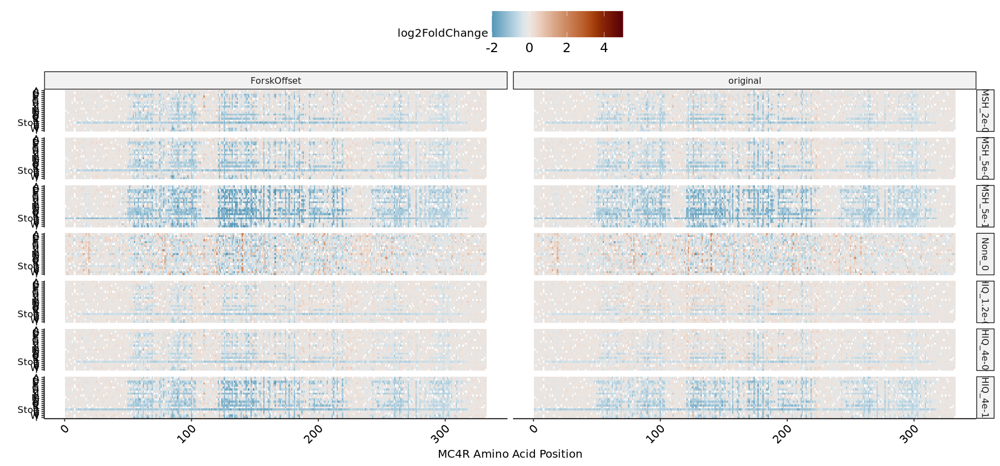

# MC4R Gs Forskolin Offsets


These plots compare the original MC4R Gs summary statistics located
[here](../MC4R-DMS5-Gs-unnormalized.tsv) with the version incorporating
forskolin barcode-level offsets located
[here](mc4r-cre-cleaned.sumstats.tsv). In general, stop effects and
global variant effect patters are stronger when incorporating the
barcode forskolin offset.

<details class="code-fold">
<summary>Code</summary>

``` r
library(ggpubr)
library(patchwork)
library(scales)
library(scico)
library(tidyverse)

source("~/dms/src/dms-analysis-utils.R")

original_sumstats <- read_tsv("../MC4R-DMS5-Gs-unnormalized.tsv", show_col_types = FALSE) %>%
    mutate(contrast = gsub("_unnormalized", "", contrast),
           group = "original") %>%
    rename("condition" = "contrast")  %>%
    filter(condition != "Forsk_2.5e-05")
forsk_offset_sumstats <- read_tsv("mc4r-cre-cleaned.sumstats.tsv", show_col_types = FALSE) %>%
    mutate(group = "ForskOffset") %>%
    select(-total_bc, -total_bc_sum, -version)

sumstats <- bind_rows(original_sumstats, forsk_offset_sumstats)

l2fc_compare <- sumstats %>%
    select(pos, aa, condition, log2FoldChange, group) %>%
    pivot_wider(names_from = group, values_from = log2FoldChange)

z_compare <- sumstats %>%
    mutate(z = log2FoldChange/log2StdError) %>%
    select(pos, aa, condition, z, group) %>%
    pivot_wider(names_from = group, values_from = z)
```

</details>
<details class="code-fold">
<summary>Code</summary>

``` r
l2fc_scatter <- l2fc_compare %>%
    ggplot() +
        geom_point(aes(x = original, y = ForskOffset), alpha = 0.2) +
        geom_abline(slope = 1, intercept = 0) +
        theme_pubr(base_size = 16) +
        ggtitle("Log2FoldChange") +
        facet_wrap(~condition)

z_scatter <- z_compare %>%
    ggplot() +
        geom_point(aes(x = original, y = ForskOffset), alpha = 0.2) +
        geom_abline(slope = 1, intercept = 0) +
        theme_pubr(base_size = 16) +
        ggtitle("Z-Statistic") +
        facet_wrap(~condition)

options(repr.plot.width = 15, repr.plot.height = 7)
l2fc_scatter + z_scatter
```

</details>


<details class="code-fold">
<summary>Code</summary>

``` r
sumstats %>%
    ggplot() +
        geom_density(aes(x = log2FoldChange/log2StdError,
                         color = if_else(aa == "X", "red", "black"),
                         lty = group)) +
        theme_pubr() +
        facet_wrap(~condition) +
        scale_color_identity()
```

</details>


<details class="code-fold">
<summary>Code</summary>

``` r
sumstats %>%
    mutate(aa = if_else(aa == "X", "Stop", aa)) %>%
    ggplot() +
            geom_tile(aes(x = pos, y = fct_rev(aa), fill = log2FoldChange)) +
            scale_fill_scico_mid(limits = c(-2,5), palette = "vik", mid = 0, oob = squish) +
            theme_pubr(base_size = 12, x.text.angle = 45) +
            theme(legend.text=element_text(size=14),
                  legend.key.size = unit(1,"cm"),
                  axis.text.y = element_text(size = 10)) +
            ylab("") + xlab("MC4R Amino Acid Position") +
            facet_grid(rows = vars(condition), 
                       cols = vars(group),
                       space = "free", scales = "free")

sumstats %>%
    mutate(aa = if_else(aa == "X", "Stop", aa)) %>%
    ggplot() +
            geom_tile(aes(x = pos, y = fct_rev(aa), fill = log2FoldChange/log2StdError)) +
            scale_fill_scico_mid(limits = c(-15,5), palette = "vik", mid = 0, oob = squish) +
            theme_pubr(base_size = 12, x.text.angle = 45) +
            theme(legend.text=element_text(size=14),
                  legend.key.size = unit(1,"cm"),
                  axis.text.y = element_text(size = 10)) +
            ylab("") + xlab("MC4R Amino Acid Position") +
            facet_grid(rows = vars(condition), 
                       cols = vars(group),
                       space = "free", scales = "free")
```

</details>




